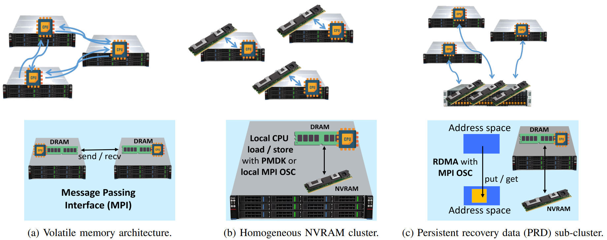

In-NVRAM-ESR: Recovery of Distributed Iterative Solvers for
Linear Systems Using Non-Volatile RAM
============
This paper investigates how to dramatically enhance in-RAM ESR performances, given all of the technological changes over the course of the last decade since firstly introduced, and eliminate its main problems, that is, extended memory footprint and constant surge of network traffic.
Our work rests on three pillars: (1) recently enabled capabilities of direct access (DAX) to NVRAM, (2) the access to such memory with MPI One-Sided Communication (OSC) over RDMA, and (3) the observation that these two capabilities allow to keep on all of the qualities of original in-RAM ESR while persisting just one copy of recovery data every persistence cycle instead of many redundancies.
This yields the enhanced in-NVRAM ESR, which instead of relying on and populating the RAM with many redundancies for fault tolerance, sends just one copy DAX-wise through RDMA directly to the persistent NVRAM. 
Accessing byte-addressable NVRAM directly, without the latency of moving data to and from the I/O bus, with comparable performances to RAM, and with a small overhead, creates a much advanced ESR mechanism, without compromising data and recovery consistency.

We implement in-NVRAM ESR with our new library of 
MPI One-Sided Communication (OSC) over RDMA under the setting of NVRAM, 
and study two possible NVRAM placements architectures: 
* Homogeneous NVRAM cluster, in which each compute node is equipped with its own NVM module, enabling the persistence of ESR state variables to local NVRAM by using either the persistent memory development kit (PMDK) libraries or a local MPI window.
* NVRAM persistent recovery data (PRD) sub-cluster, in which recovery data is persisted in dedicated PRD sub-cluster nodes via remote MPI 
one-sided communication implemented using RDMA. 

In the PRD sub-cluster architecture, we assume RAID between nodes to provide fault tolerance to errors in the sub-cluster. Otherwise, each node of the sub-cluster behaves as a single point of failure. We stress that while in-RAM ESR's data transportation increases quadratically with the cluster size, the increase writes of RAID is linear and depends on RAID level. 

The following figure illustrates the ESR algorithm in 3 architectures: (a) In-RAM-ESR, (b) In-NVRAM-ESR with Homogeneous Cluster and (c) In-NVRAM-ESR with remote PRD sub-cluster.



Our implementations are build on the code supplied by Carlos Pachajoa, Wilfried N. Gansterer et al. based on their previous work
on Exact State Reconstruction with Period (ESRP) for the Conjugate Gradient solver [[1]](#1). 

**Compiling prerequisite library - MPI pmem ext:**

The MPI One-Sided Communication Pmem extension library needs to be compiled and linked to our implementation as follows:
```
cd NVMESR/mpi-pmem-ext
```
```
module load gnu/8.1.0 mpich/3.2 pmdk/1.9
``` 
```
autoreconf -i
```

supply the path to install the library (with ```--path```) and paths to mpicc, mpic++ (with ```CC``` and ```CXX```) and run:
```
./configure --prefix=YOUR_INSTALLED_MPI_PMEM_EXT_DIR CC=/opt/ohpc/pub/mpi/mpich-gnu-ohpc/3.2.1/bin/mpicc CXX=/opt/ohpc/pub/mpi/mpich-gnu-ohpc/3.2.1/bin/mpic++
``` 

then, the library will be installed with the next commands:
```
make
```
```
make install
```

**Compiling NVM-ESR implementation:**
```
cd NVMESR/esrp_branch
```
```
module load gnu/8.1.0 mpich/3.2 pmdk/1.9 gsl/2.4 openblas/0.2.20
``` 
- make sure all the relevant libraries are exported and match the linking paths in ```Makefile```.
- make sure ```libmpi-pmem-one-sided.so.0``` is on ```LD_LIBRARY_PATH```
```
make
```

**Running NVM-ESR:**
```
module load gnu/8.1.0 mpich/3.2 pmdk/1.9 gsl/2.4 openblas/0.2.20
```
- See ```NVMESR/esrp_branch/run_experiments_with_slurm.sh``` for execution examples via SLURM on your cluster.

## References
<a id="1">[1]</a> 
Pachajoa, Carlos and Pacher, Christina and Levonyak, Markus and Gansterer, Wilfried N., 
Algorithm-based checkpoint-recovery for the conjugate gradient method,
49th international conference on parallel processing-icpp, p. 1-11, 2020.

